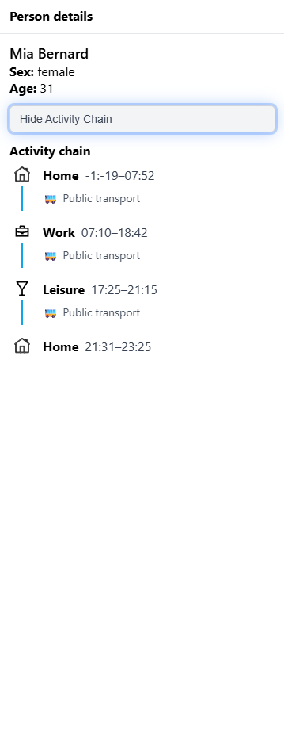
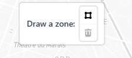

# City Analyzer 🗺️

Interactive map application for visualizing and analyzing population activity patterns in Paris. Built with React, TypeScript, and Mapbox GL JS.

  


---

## 📋 Table of Contents

- [Features](#-features)
- [Quick Start](#-quick-start)
- [How to Use](#-how-to-use)
  - [Layer Controls](#1-layer-controls)
  - [Filtering Population](#2-filtering-population)
  - [Time Slider](#3-time-slider)
  - [Selecting a Person](#4-selecting-a-person)
  - [Viewing Activity Chains](#5-viewing-activity-chains)
  - [Drawing and Analyzing Zones](#6-drawing-and-analyzing-zones)
- [Technology Stack](#-technology-stack)
- [Project Structure](#-project-structure)
- [Data Generation](#-data-generation)
- [Development](#-development)

---

## ✨ Features

- **Interactive Map Visualization**: Mapbox GL-powered map with clustering for better performance
- **Realistic Population Data**: Synthetic population with age-appropriate activity patterns
- **Multi-Dimensional Filtering**: Filter by age group, sex, activity type, and time of day
- **Zone Analysis**: Draw custom polygons and get instant metrics
- **Activity Chain Visualization**: See individual daily movement patterns
- **Real-time Metrics Dashboard**: Charts showing activity distribution, demographics, and temporal patterns

---

## 🚀 Quick Start

### Prerequisites

- Node.js 16+ and npm
- Mapbox account and access token (free tier available at [mapbox.com](https://mapbox.com))

### Installation

1. **Clone the repository**:
   ```bash
   git clone https://github.com/achadr/city-analyzer.git
   cd city-analyzer
   ```

2. **Install dependencies**:
   ```bash
   npm install
   ```

3. **Set up environment**:

   Create a `.env` file in the project root:
   ```
   VITE_MAPBOX_TOKEN=your_mapbox_token_here
   ```

4. **Generate population data**:
   ```bash
   npm run generate
   ```
   This creates `data/population.json` with 1000 synthetic individuals

5. **Start development server**:
   ```bash
   npm run dev
   ```

6. **Open your browser**:

   Navigate to `http://localhost:5173`

---

## 📖 How to Use

### 1. Layer Controls

The **left panel** contains layer visibility toggles and filtering options. Click the **Layers** tab to control what's visible on the map:

**What you can do:**
- Toggle Paris arrondissement boundaries on/off
- Toggle population clusters visibility
- Clusters show the number of people in each area

---

### 2. Filtering Population

Switch to the **Filters** tab in the left panel to filter the population data:


**How filtering works:**
- **Age Filter**: Show only people in specific age groups (0-17, 18-25, 26-34, 35-64, 65+)
- **Sex Filter**: Filter by gender (All, Male, Female)
- **Activity Filter**: Show only specific activity types (Home, Work, School, Leisure)
- **Combined Filtering**: All filters work together simultaneously
- Cluster counts update in real-time to reflect active filters

**Example Use Cases:**
- Find where teenagers go to school: `Age: 0-17` + `Activity: School`
- Analyze elderly leisure patterns: `Age: 65+` + `Activity: Leisure`
- Study working-age male commuting: `Sex: Male` + `Age: 26-34` + `Activity: Work`

---

### 3. Time Slider

The **time slider** at the bottom filters activities by time of day:


**How to use:**
- Drag the slider to see activities at different times
- Time range: 00:00 - 23:45 in 15-minute increments
- Map updates in real-time to show only activities happening at that time
- Combine with filters for temporal analysis (e.g., "where are kids at 15:00?")

**Example:**
- Set time to `08:00` to see morning commute patterns
- Set time to `12:00` to see lunch-time activities
- Set time to `22:00` to see evening/home activities

---

### 4. Selecting a Person

**How to select:**
1. Zoom into the map (clusters will break down into individual points)
2. Click on any blue point (person)
3. The **right panel** appears with person details



**Information shown:**
- Person's name, age, and sex
- Current activity at the selected time
- Activity location, duration, and transport method
- Toggle button to show their complete activity chain

---

### 5. Viewing Activity Chains

**How to activate:**
1. Select a person (see above)
2. Click the **"Show Activity Chain"** toggle button
3. The map shows the person's full daily journey


**What you see:**
- Blue lines connecting activity locations in sequence
- Numbered markers for each activity
- Complete timeline of the person's day in the panel
- Transport methods used between activities

**To exit:** Click "Show Activity Chain" again or close the panel

---

### 6. Drawing and Analyzing Zones

**How to draw a zone:**

1. **Find the drawing controls** on the map:

   

2. **Click the polygon tool** to activate drawing mode

3. **Draw your zone:**
   - Click to place each corner point
   - Move your mouse to shape the polygon
   - **Double-click** or **click on the first point** to finish and close the polygon

   

4. **The zone metrics panel appears automatically:**

   

**Metrics Explained:**

1. **Total Activities**: Number of activities occurring in the zone
   - Note: Consecutive home activities at the same location count as one

2. **Unique Visitors**: Number of different people who visit the zone

3. **Activity Types (Pie Chart)**:
   - Shows percentage breakdown: Home, Work, School, Leisure
   - Hover over slices to see exact activity counts

4. **Activities by Hour (Bar Chart)**:
   - 24-hour timeline showing when activities occur
   - Peak hours are visible at a glance
   - Hover to see exact count for each hour

5. **Age Distribution (Bar Chart)**:
   - Shows which age groups use the zone
   - Groups: 0-17, 18-25, 26-34, 35-64, 65+
   - Hover for exact counts

**Editing/Deleting Zones:**
- Click the zone to select it
- Use the trash icon to delete
- Click and drag vertices to reshape

**Multiple Zones:**
- You can have multiple zones on the map
- Only the most recently selected/drawn zone shows metrics
- Switch between zones by clicking them

**Use Cases:**
- **Park Analysis**: Draw around a park to see visitor demographics
- **Business District**: Analyze work patterns in commercial areas
- **Residential Area**: Study home activity distribution
- **School Zone**: Check student traffic patterns
- **Transit Hub**: Analyze commuter flows around stations

---

### 🎯 Advanced Usage Tips

**Combining Features:**

1. **Time-based Zone Analysis**:
   - Draw a zone around a school
   - Move time slider to 08:00 → see morning drop-off
   - Move to 15:00 → see afternoon pickup

2. **Demographic Activity Patterns**:
   - Filter: `Age: 18-25` + `Activity: Leisure`
   - Move time slider through evening hours
   - See where young adults spend time

3. **Individual Journey Context**:
   - Select a person
   - Toggle activity chain
   - Note their workplace location
   - Draw zone around workplace to see coworkers' patterns

4. **Comparative Analysis**:
   - Draw zone around a residential area
   - Note the metrics
   - Draw zone around a commercial area
   - Compare activity type distributions

---

## 🛠 Technology Stack

| Technology | Purpose |
|------------|---------|
| **React 19** | UI framework with modern hooks |
| **TypeScript** | Type safety and developer experience |
| **Vite** | Fast build tool and dev server with HMR |
| **Mapbox GL JS** | Map rendering and GeoJSON visualization |
| **Turf.js** | Geospatial analysis (distance calculations, point-in-polygon) |
| **Recharts** | Data visualization (bar charts, pie charts) |
| **MapboxDraw** | Interactive polygon drawing |

---

## 📁 Project Structure

```
city-analyzer/
├── src/
│   ├── components/          # React UI components
│   │   ├── SidePanel.tsx    # Layers and filters panel
│   │   ├── PersonPanel.tsx  # Person details and zone metrics
│   │   ├── TimeSlider.tsx   # Time filtering control
│   │   └── icons/           # Icon components
│   ├── maps/                # Map-related components
│   │   ├── MapView.tsx      # Main Mapbox GL component
│   │   └── utils/
│   │       ├── time.ts      # Time filtering utilities
│   │       ├── age.ts       # Age/sex/activity filters
│   │       └── zoneMetrics.ts # Zone analysis calculations
│   ├── generators/
│   │   └── populationGenerator.ts # Synthetic data generation
│   ├── types/               # TypeScript definitions
│   ├── constants/           # App-wide constants
│   └── styles/              # Shared style objects
├── data/
│   ├── population.json      # Generated population data
│   └── paris-arrondissements.geojson # District boundaries
├── docs/
│   └── images/              # Screenshots for documentation
├── public/                  # Static assets
├── CLAUDE.md               # Development workflow docs
└── README.md               # This file
```

---

## 🎲 Data Generation

The population generator (`src/generators/populationGenerator.ts`) creates realistic synthetic data:

### Features:
- **Age-appropriate activities**:
  - Babies (0-5): Home activities only
  - Students (6-18): Home + school + leisure
  - Working adults (19-64): Home + work/school + leisure
  - Retirees (65+): Home + leisure

- **Distance-based transport**:
  - < 1km: Walk (70%) or bike (30%)
  - 1-5km: Bike (40%), public transport (40%), walk (20%)
  - 5-10km: Public transport (60%), bike (25%), car (15%)
  - > 10km: Public transport (50%), car (50%)

- **Realistic time variations**:
  - Work: 08:00-17:00 ±30 minutes
  - School: 08:30-16:00 ±15 minutes
  - Leisure: Evening hours with variations

- **Demographic distribution**:
  - Weighted age groups reflecting Paris demographics
  - 50/50 gender split
  - 85% employment rate for working-age adults

### Customization:

Edit `src/generators/populationGenerator.ts` to adjust:
- Population size (default: 1000)
- Age distribution weights
- Activity patterns
- Time ranges
- Transport preferences

Then regenerate:
```bash
npm run generate
```

---

## 💻 Development

### Available Scripts

```bash
# Development
npm run dev          # Start dev server (http://localhost:5173)
npm run build        # TypeScript compile + production build
npm run preview      # Preview production build locally

# Data Generation
npm run generate     # Create new population.json
```

### Architecture Overview

**Data Flow:**
```
App.tsx (root state)
  ↓
  ├─→ SidePanel (layers, filters)
  ├─→ MapView (map rendering, GeoJSON)
  ├─→ PersonPanel (details, metrics, charts)
  └─→ TimeSlider (time filtering)
```

**Filtering Pipeline:**
```
population.json
  → GeoJSON conversion (MapView.tsx)
  → Time filter (filterByTime)
  → Age filter (filterByAgeBand)
  → Sex filter (filterBySex)
  → Activity filter (filterByActivity)
  → Mapbox GL rendering with clusters
```

**Zone Analysis:**
```
Drawn polygon
  → Get zone geometry
  → Filter activities by point-in-polygon (Turf.js)
  → Deduplicate consecutive home activities
  → Calculate metrics (totals, distributions)
  → Render charts (Recharts)
```

### Key Files to Know

- **`src/App.tsx`**: Root component, manages all state
- **`src/maps/MapView.tsx`**: Mapbox GL integration, GeoJSON handling
- **`src/components/PersonPanel.tsx`**: Right panel with charts and metrics
- **`src/maps/utils/zoneMetrics.ts`**: Zone analysis calculations
- **`src/types/index.ts`**: All TypeScript type definitions
- **`CLAUDE.md`**: Detailed architecture documentation

### Development Workflow

See [CLAUDE.md](./CLAUDE.md) for:
- Git workflow (feature branch per session)
- Detailed architecture documentation
- Code organization principles
- Component responsibilities

---

## 📝 License

MIT

---

## 🤝 Contributing

Contributions welcome! Please feel free to submit issues or pull requests.

---

## 📧 Contact

For questions or suggestions, please open an issue on GitHub.

---

**Built with ❤️ using React, TypeScript, and Mapbox GL JS**
